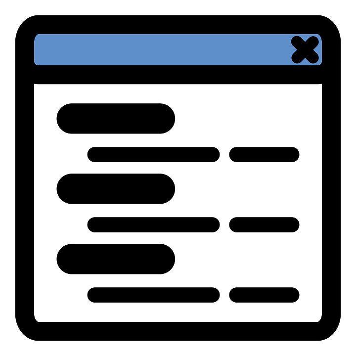

  

<h1 align="center">Youtube AdBlocker Popup Disabler Extension</h1>

  <b >"Turn off your AdBlocker" Popup Disabler Extension for YouTube</b>

  
## Installation

### For Chrome:

-   Clone the repository.
-   Open Chrome and navigate to chrome://extensions/
-   Turn on developer mode.
-   Click "Load Unpacked" and select the folder from the cloned repository.
-   The extension is now installed and will automatically block ads on YouTube videos.

  
## Changelogs:
### 0.2 Beta: Updating Functionality, Bug Fixes
### 0.2.1 Beta: Fixing some Bugs
### 0.2.2 Beta: general function bug fixes
